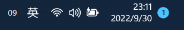

# Tray Second

Show current send on system tray. Slight modification based on code from [kas/percentage](https://github.com/kas/percentage).

## Installing

1. [Download the latest release](https://github.com/jerrylususu/tray_second/releases)
1. Put seconds.exe in your startup folder
   1. To get to your startup folder, press Windows+R, type "shell:startup", then press enter

